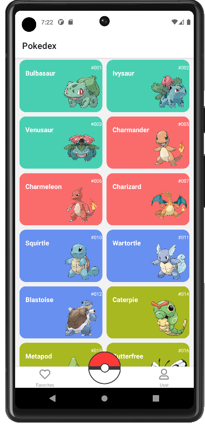
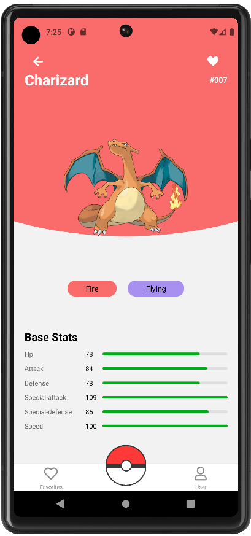
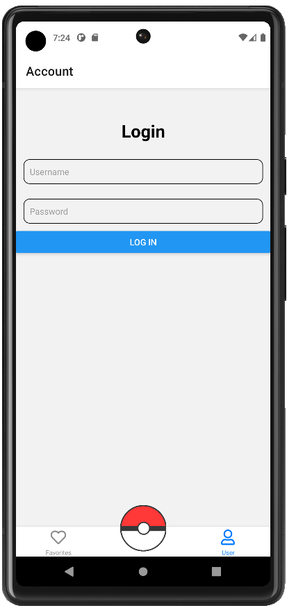
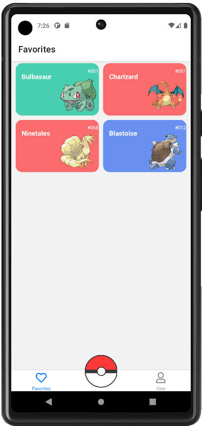
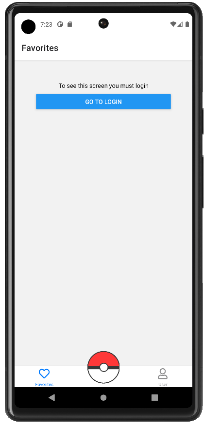

# Pokemon App

This repository is about a Pokemon app, where you can search for different Pokemons, learn information about it and save them in favorites.

## Description

I used for the creation React Native, Formik and Yup.

## Screenshots

### Home

### Pokemon Details

### Login 1

### Login 2

### Favorites 1

### Favorites 2

## Project Visualization

You can see the project at you can do it with a cell phone emulator or file manager for physical phones, just go to the link and download the app (Android): https://expo.dev/artifacts/98191252-a765-47f7-a97f-b8e8866fa551